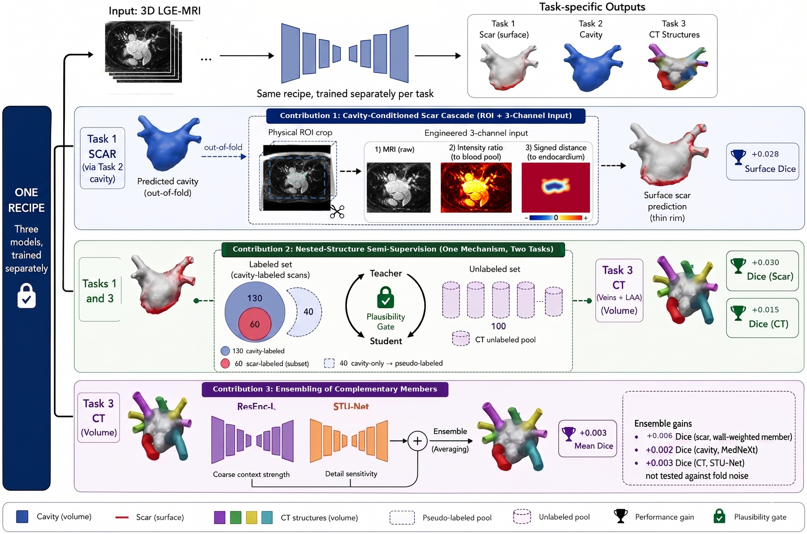
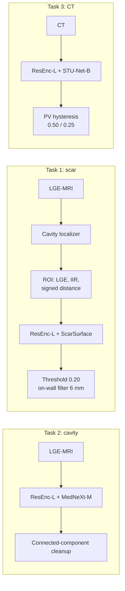
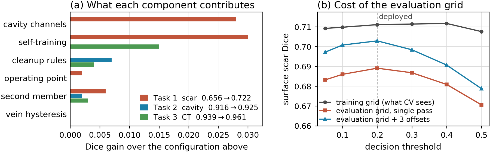

<h1 align="center">
<strong>SCALA: Semi-supervised Cascade for Left Atrial Scar, Cavity, and Multi-Structure CT Segmentation</strong>
</h1>

<div align="center">

<a href="https://git.io/typing-svg">

</a>

[](https://openreview.net/forum?id=WylqMXauzj)
[](#-overview)
[](https://openreview.net/forum?id=WylqMXauzj)
[](https://huggingface.co/adidukre/SCALA)
[](#-method)
[](#-docker)
[](https://visitorbadge.io/status?path=https%3A%2F%2Fgithub.com%2Fadinathdukre%2FSCALA)

<h3>📄 <a href="https://openreview.net/forum?id=WylqMXauzj">Paper</a> &nbsp;|&nbsp; 🤗 <a href="https://huggingface.co/adidukre/SCALA">Checkpoints</a> &nbsp;|&nbsp; 🧠 <a href="#-method">Method</a> &nbsp;|&nbsp; ⚡ <a href="#-inference">Inference</a></h3>

**Atharva Atul Rege, [Adinath Madhavrao Dukre](https://github.com/adinathdukre), Sarth Santosh Shah, Imran Razzak**


</div>

## 🔥 News
- **[30 Sep 2026]** 🚀 Code, Docker build and checkpoints for all three CARE LeftAtrium tasks are released.
- **[24 Aug 2026]** 🎉 Our SCALA paper is accepted as an **oral presentation** at the MICCAI 2026 CARE workshop and published on [OpenReview](https://openreview.net/forum?id=WylqMXauzj).

## Overview
Official code for **SCALA**, our solution to the three tasks of the **MICCAI 2026 CARE LeftAtrium challenge**:

| Task | Modality | Target |
|---|---|---|
| **Task 1** | LGE-MRI | Left atrial scar quantification |
| **Task 2** | LGE-MRI | Left atrial cavity segmentation |
| **Task 3** | CT | Multi-structure segmentation (LA, LAA, PV) |

<p align="center">

<br/>
<em><b>Fig. 1.</b> Overview. One recipe is instantiated three times and trained separately; the only path between tasks is the out-of-fold cavity prediction that conditions the scar model. Image panels are real slices; the 3D shapes and icons are schematic.</em>
</p>



## 📖 Contents
- [🧠 Method](#-method)
- [🏆 Results](#-results)
- [⛏️ Installation](#️-installation)
- [🧩 Pretrained Checkpoints](#-pretrained-checkpoints)
- [⚡ Inference](#-inference)
- [🐳 Docker](#-docker)
- [🏋️ Training](#️-training)
- [🗂️ Repository Structure](#️-repository-structure)
- [📝 Citation](#-citation)
- [📚 Acknowledgments](#-acknowledgments)
- [📨 Contact](#-contact)

## 🧠 Method

SCALA uses three task-specific residual-encoder nnU-Net pipelines. They share one training recipe and one deployment path but no parameters.

- **Scar cascade (Task 1).** An out-of-fold cavity prediction localizes the atrium. The scar network sees a cropped ROI with three channels: the LGE image, the image intensity ratio (IIR, LGE divided by the blood-pool mean), and the signed distance to the endocardial surface. Two members are averaged: a plain ResEnc-L and a ResEnc-L trained with an extra wall-weighted soft-Dice term. An on-wall filter then removes components more than 6 mm from the cavity.
- **Self-training on the nested labels.** Scar: 40 LGE scans that have a cavity label but no scar label are pseudo-labeled by a five-fold teacher. CT: 99 of the 100 unlabeled whole-chest CTs are pseudo-labeled and cropped to the LA complex. Pseudo-labeled cases only ever enter the training folds.
- **Heterogeneous ensembles.** Cavity: ResEnc-L + MedNeXt-M. CT: ResEnc-L + STU-Net-B, fine-tuned from TotalSegmentator weights.
- **Structure-specific decision rules.** Cavity: connected-component cleanup. CT: double-threshold pulmonary-vein hysteresis (0.50/0.25), keeping only vein branches that touch the LA body. Scar: probability threshold 0.20.
- **Acquisition-grid correction.** The scar models are planned at 2.5 mm through-plane, but the test images are 1 mm isotropic. We predict at several sub-slice z offsets (the number is set by the spacing ratio) and take the voxel-wise median.

## 🏆 Results

<div align="center">

| | Scar (Task 1) | Cavity (Task 2) | CT (Task 3) |
|---|:---:|:---:|:---:|
| 5-fold cross-validation | surface Dice 0.722 | Dice 0.925 | mean Dice 0.961 |
| Hidden test set (organizers) | G-DSC 0.363 | Dice 0.830, HD 22.55 mm | Dice 0.954, HD 9.33 mm |

</div>

<p align="center">

<br/>
<em><b>Fig. 2.</b> (a) Dice contributed by each component against the configuration above it, with each task’s baseline and deployed score in the legend. (b) Surface scar Dice against decision threshold on 15 out-of-fold cases: the evaluation grid costs 0.022 at the deployed threshold and offset voting returns 0.014.</em>
</p>

## ⛏️ Installation

```bash
git clone https://github.com/adinathdukre/SCALA.git
cd SCALA
pip install -e .
```

> [!NOTE]
> Tested with nnU-Net v2.8.0 and dynamic_network_architectures 0.4.4; PyTorch 2.12 for training and PyTorch 2.8 in the Docker image.

Custom trainers are loaded through nnU-Net's `nnUNet_extTrainer` hook, so the nnU-Net installation is never modified. `scripts/env.sh` sets this variable and the nnU-Net paths. Edit the `/path/to/...` defaults in it, or export `SCALA_DATA`, `SCALA_WORK`, `nnUNet_raw`, `nnUNet_preprocessed` and `nnUNet_results` first:

```bash
source scripts/env.sh
```

## 🧩 Pretrained Checkpoints

All checkpoints are on Hugging Face: **[adidukre/SCALA](https://huggingface.co/adidukre/SCALA)**

```bash
huggingface-cli download adidukre/SCALA --local-dir /path/to/checkpoints
```

| Folder | Task | Training data | Trainer |
|---|:---:|---|---|
| `cavity_resenc` | 1, 2 | Dataset501 (130 LGE-MRI) | `nnUNetTrainer` (ResEnc-L) |
| `cavity_mednext` | 2 | Dataset501 | `nnUNetTrainerMedNeXt` |
| `scar_resenc` | 1 | Dataset512 (60 labeled + 40 pseudo-labeled) | `nnUNetTrainer` (ResEnc-L) |
| `scar_surface` | 1 | Dataset512 | `nnUNetTrainerScarSurface` |
| `ct_resenc` | 3 | Dataset522 (50 labeled + 99 pseudo-labeled) | `nnUNetTrainer` (ResEnc-L) |
| `ct_stunet` | 3 | Dataset522 | `STUNetTrainer_base_ft` |

Each folder is a standard nnU-Net result folder: `plans.json`, `dataset.json`, and `fold_0` to `fold_4`, each holding `checkpoint_best.pth`.

## ⚡ Inference

```bash
python -m scala.predict --task task1 -i /path/to/input -o /path/to/output -m /path/to/checkpoints
```

| Argument | Meaning |
|---|---|
| `--task` | `task1` (scar), `task2` (cavity) or `task3` (CT) |
| `-i` | the challenge layout (`input/taskN/<case>/<image>.nii.gz`), a folder of case subfolders, or a flat folder of `.nii.gz` images |
| `--folds` | default `0,1,2,3,4` (all five) |
| `--tta` | mirror TTA, off in our submission |
| `--device` | e.g. `cpu` |

Output follows the challenge naming (`<case>/<id>_pred.nii.gz`), on the input grid, as `uint8`. Task 1 and Task 2 write binary masks; Task 3 writes labels `{0: background, 1: LA, 2: LAA, 3: PV}`.

> [!TIP]
> Task 1 is end-to-end: the cavity is predicted inside the pipeline, so only the LGE image is needed.

## 🐳 Docker

```bash
bash docker/build.sh task1 /path/to/checkpoints scala-task1
docker run --rm --gpus all -v /path/to/input:/input:ro -v /path/to/output:/output scala-task1
```

- The build copies only the members the task needs.
- The build runs a self-test that loads every model, so a broken image fails at build time.
- The container falls back to single-process preprocessing when `/dev/shm` is small, so it also works with Docker's default 64 MB.

## 🏋️ Training

Place the challenge training data under `$SCALA_DATA`, which should contain the three released task folders. Then run the stages below in order. In every `nnUNetv2_train` loop, `F` runs over folds 0 to 4.

<details open>
<summary><strong>1. Convert the data and write the patient-level splits</strong> (cavity and scar share the same splits)</summary>

```bash
source scripts/env.sh
python -m scala.data.convert --task all
nnUNetv2_plan_and_preprocess -d 501 521 -pl nnUNetPlannerResEncL -c 3d_fullres --verify_dataset_integrity
python -m scala.data.splits --dataset cavity
python -m scala.data.splits --dataset cardiac
```

</details>

<details>
<summary><strong>2. Train the cavity models</strong> (Task 2, and the Task 1 localizer)</summary>

```bash
nnUNetv2_train 501 3d_fullres F -p nnUNetResEncUNetLPlans
nnUNetv2_train 501 3d_fullres F -p nnUNetResEncUNetLPlans -tr nnUNetTrainerMedNeXt
```

</details>

<details>
<summary><strong>3. Build the scar dataset from out-of-fold cavity predictions, then train the scar teacher</strong></summary>

```bash
python -m scala.data.cavity_oof
python -m scala.data.scar_cavity_map
python -m scala.data.build_scar_dataset
nnUNetv2_plan_and_preprocess -d 511 -pl nnUNetPlannerResEncL -c 3d_fullres --verify_dataset_integrity
python -m scala.data.splits --dataset scar
nnUNetv2_train 511 3d_fullres F -p nnUNetResEncUNetLPlans
```

</details>

<details>
<summary><strong>4. Scar self-training and the two scar members</strong> (Task 1)</summary>

```bash
python -m scala.semisup.scar_pseudo_label
nnUNetv2_plan_and_preprocess -d 512 -pl nnUNetPlannerResEncL -c 3d_fullres --verify_dataset_integrity
python -m scala.data.splits --dataset scar_ssl
nnUNetv2_train 512 3d_fullres F -p nnUNetResEncUNetLPlans
nnUNetv2_train 512 3d_fullres F -p nnUNetResEncUNetLPlans -tr nnUNetTrainerScarSurface
```

</details>

<details>
<summary><strong>5. CT teacher, self-training and the two CT members</strong> (Task 3)</summary>

> [!IMPORTANT]
> For the STU-Net member, first download the TotalSegmentator-pretrained STU-Net-B weights (`base_ep4k.model`) from the [STU-Net repository](https://github.com/uni-medical/STU-Net).

```bash
nnUNetv2_train 521 3d_fullres F -p nnUNetResEncUNetLPlans
python -m scala.semisup.ct_pseudo_label
nnUNetv2_plan_and_preprocess -d 522 -pl nnUNetPlannerResEncL -c 3d_fullres --verify_dataset_integrity
python -m scala.data.splits --dataset cardiac_ssl
nnUNetv2_train 522 3d_fullres F -p nnUNetResEncUNetLPlans
python scripts/train_stunet.py 522 3d_fullres F -p nnUNetResEncUNetLPlans \
    -tr STUNetTrainer_base_ft -pretrained_weights /path/to/base_ep4k.model
```

</details>

<details>
<summary><strong>6. Export slim checkpoints</strong> in the layout <code>scala.predict</code> expects</summary>

```bash
python scripts/export_checkpoints.py --out /path/to/checkpoints
```

</details>

**Training schedule.** We stopped each fold once its EMA pseudo-Dice had plateaued, then kept `checkpoint_best.pth`:

| Members | Epochs per fold |
|---|---|
| Scar | 101 to 151 |
| Cavity | 250 to 418 (MedNeXt: 250-epoch budget) |
| CT | 155 to 443 |

All models were trained on a single 96 GB NVIDIA RTX PRO 6000 Blackwell GPU.

## 🗂️ Repository Structure

```text
SCALA/
├── scala/
│   ├── config.py        # paths, dataset names, constants
│   ├── predict.py       # inference entry point (CLI and Docker)
│   ├── data/            # conversion, splits, IIR, signed distance, scar dataset builder
│   ├── semisup/         # scar and CT pseudo-labeling
│   ├── nnunet_ext/      # custom nnU-Net trainers (ScarSurface, MedNeXt, STU-Net)
│   ├── postprocess/     # cavity cleanup, CT vein hysteresis, scar on-wall filter
│   └── inference/       # predictors, scar cascade, ensemble pipelines
├── scripts/             # environment, STU-Net fine-tuning launcher, checkpoint export
└── docker/              # Dockerfile and build script
```

## 📝 Citation

If you find our paper and code useful in your research, please cite:

```bibtex
@inproceedings{rege2026scala,
  title={SCALA: Semi-supervised Cascade for Left Atrial Scar, Cavity, and Multi-Structure CT Segmentation},
  author={Rege, Atharva Atul and Dukre, Adinath Madhavrao and Shah, Sarth Santosh and Razzak, Imran},
  booktitle={CARE 2026: Comprehensive Analysis of REal-world medical images-heart and liver},
  year={2026},
  url={https://openreview.net/forum?id=WylqMXauzj}
}
```

## 📚 Acknowledgments

This work builds on:

- [**nnU-Net**](https://github.com/MIC-DKFZ/nnUNet): the self-configuring segmentation framework behind every pipeline.
- [**MedNeXt**](https://github.com/MIC-DKFZ/MedNeXt): the architecture code in `scala/nnunet_ext/mednext` is adapted from this repository.
- [**STU-Net**](https://github.com/uni-medical/STU-Net): the architecture in `scala/nnunet_ext/stunet.py` is adapted from this repository.

We thank the CARE 2026 organizers for the data and the evaluation.

## 📨 Contact
For questions or collaboration, please open an [issue](https://github.com/adinathdukre/SCALA/issues) or reach out to [Adinath Madhavrao Dukre](https://github.com/adinathdukre).

> [!IMPORTANT]
> SCALA is intended for research only. It is not approved for clinical use and must not inform any diagnostic or treatment decision.
